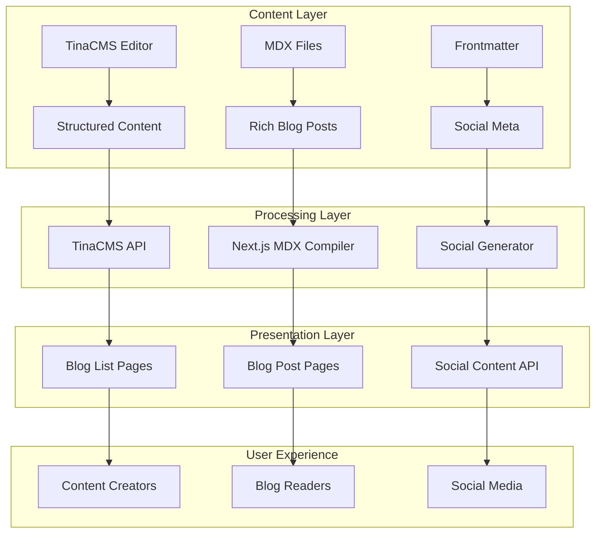

# ADR: Minimal MDX Content System

**Date:** 2025-10-06  
**Status:** Accepted  
**Context:** Add MDX support to existing Next.js + TinaCMS app for blog posts and social content generation

## Executive Summary

**Do this now:** Add `@next/mdx` and `@mdx-js/react` to existing setup with zero config changes to TinaCMS. Use Next.js built-in MDX support with automatic JSX runtime. **Evolve to** dedicated content API and headless CMS **when** publishing >10 posts/week or team >3 people.

## Decision

### What we're building
- Blog posts with embedded React components (videos, interactive elements, social embeds)
- Social media content auto-generation from blog frontmatter
- Zero-config MDX processing using Next.js built-in support

### Architecture choice: **Hybrid File + CMS**
- Keep existing TinaCMS for structured content editing
- Add MDX files for rich blog posts that need React components
- Use Next.js automatic MDX compilation (no webpack config needed)

## Context

### Goals (90 days)
- 2-3 blog posts/week
- Social content generation
- Non-technical content creator friendly
- <1000 monthly readers

### Constraints
- Team: 1-2 people, content-focused
- Budget: Minimal
- Existing: Next.js 13+ app router + TinaCMS

### Non-functional requirements
- Load time: <2s (blog pages)
- Edit experience: WYSIWYG for basic content, code editor for advanced
- SEO: Full meta tag support
- Social: Auto-generate Twitter/LinkedIn posts

## Technical Decision

### JSX Runtime Explained (Simple Terms)
The "JSX runtime" is how React converts your `<Component />` syntax into actual JavaScript. With Next.js 13+, this happens automatically - you don't need to import React in every file anymore. For MDX, this means you can write:

```mdx
# My Blog Post

<YouTubeEmbed videoId="abc123" />

This is **markdown** with React components mixed in!
```

And Next.js automatically converts the JSX parts to working React components.

### Implementation Plan

#### Phase 1: Minimal MDX (Ship in 3 days)
```
app/
  content/
    blogs/           # Keep existing TinaCMS blogs
    mdx/            # New: MDX blog posts
      2025-10-06-my-first-mdx-post.mdx
  components/
    mdx/             # Reusable MDX components
      YouTubeEmbed.tsx
      TwitterEmbed.tsx
  lib/
    mdx.ts          # MDX utilities
    social.ts       # Social content generation
```

#### Architecture Diagram



## Implementation Details

### Package Additions (Exact)
```bash
npm install @next/mdx @mdx-js/react @mdx-js/loader
npm install --save-dev @types/mdx
```

### File Changes Required

#### 1. `next.config.ts` - Enable MDX
```typescript
import createMDX from '@next/mdx'

const nextConfig = {
  pageExtensions: ['js', 'jsx', 'mdx', 'ts', 'tsx'],
  experimental: {
    mdxRs: true, // Use faster Rust-based MDX compiler
  },
}

const withMDX = createMDX({
  options: {
    remarkPlugins: [],
    rehypePlugins: [],
  },
})

export default withMDX(nextConfig)
```

#### 2. `app/mdx-components.tsx` - Global MDX Components
```typescript
import type { MDXComponents } from 'mdx/types'
 
export function useMDXComponents(components: MDXComponents): MDXComponents {
  return {
    h1: ({ children }) => <h1 className="text-4xl font-bold mb-6">{children}</h1>,
    h2: ({ children }) => <h2 className="text-3xl font-bold mb-4">{children}</h2>,
    p: ({ children }) => <p className="mb-4 leading-relaxed">{children}</p>,
    ...components,
  }
}
```

#### 3. `app/lib/mdx.ts` - MDX Utilities
```typescript
import fs from 'fs'
import path from 'path'
import matter from 'gray-matter'

const MDX_PATH = path.join(process.cwd(), 'app/content/mdx')

export function getMDXFiles() {
  return fs.readdirSync(MDX_PATH).filter(file => file.endsWith('.mdx'))
}

export function getMDXPost(slug: string) {
  const filePath = path.join(MDX_PATH, `${slug}.mdx`)
  const source = fs.readFileSync(filePath, 'utf8')
  const { content, data } = matter(source)
  
  return {
    content,
    frontmatter: data,
    slug,
  }
}
```

#### 4. `app/components/mdx/YouTubeEmbed.tsx` - Example Component
```typescript
interface YouTubeEmbedProps {
  videoId: string
  title?: string
}

export function YouTubeEmbed({ videoId, title = "YouTube video" }: YouTubeEmbedProps) {
  return (
    <div className="relative aspect-video my-8">
      <iframe
        src={`https://www.youtube.com/embed/${videoId}`}
        title={title}
        className="w-full h-full rounded-lg"
        allowFullScreen
      />
    </div>
  )
}
```

### Content Creator Workflow

#### For Basic Posts: Use TinaCMS (No Change)
1. Open `/admin`
2. Create/edit with visual editor
3. Publish

#### For Rich Posts: Use MDX Files
1. Create `app/content/mdx/2025-10-06-my-post.mdx`
2. Add frontmatter + MDX content
3. Use components: `<YouTubeEmbed videoId="abc123" />`
4. Git commit to publish

### Social Content Generation
```typescript
// app/lib/social.ts
export function generateSocialContent(post: { title: string, excerpt: string, url: string }) {
  return {
    twitter: `🚀 New blog post: ${post.title}\n\n${post.excerpt}\n\nRead more: ${post.url}`,
    linkedin: `I just published a new article: "${post.title}"\n\n${post.excerpt}\n\nWhat are your thoughts? Read the full post here: ${post.url}`,
  }
}
```

## Shortcuts Taken (Scale-Later Issues)

### Immediate Shortcuts
1. **No build-time optimization** - MDX compiled on-demand
   - *Trigger:* Page load >3s or >100 concurrent users
   - *Solution:* Pre-compile MDX at build time

2. **File-based routing only** - No dynamic content management
   - *Trigger:* Non-technical users need to create MDX posts
   - *Solution:* Add MDX editor to TinaCMS admin

3. **No image optimization** - Manual image handling
   - *Trigger:* Images >500KB or slow page loads
   - *Solution:* Add `next/image` + CDN integration

4. **In-memory social generation** - No scheduled posting
   - *Trigger:* >5 posts/week or need automation
   - *Solution:* Add social media scheduling API

### GitHub Issues to Create
```markdown
## Scale-Later: MDX Build Optimization
**Label:** `scale-later`
**Trigger:** Page load >3s OR >100 concurrent users
**Acceptance Criteria:**
- [ ] MDX files compiled at build time
- [ ] Static generation for blog posts
- [ ] Build time <2min

## Scale-Later: TinaCMS MDX Editor  
**Label:** `scale-later`
**Trigger:** Non-technical users need MDX editing
**Acceptance Criteria:**
- [ ] Visual MDX editor in TinaCMS admin
- [ ] Component picker for YouTube, Twitter embeds
- [ ] Preview mode for MDX content

## Scale-Later: Social Media Automation
**Label:** `scale-later`  
**Trigger:** >5 posts/week OR team requests automation
**Acceptance Criteria:**
- [ ] Scheduled social media posting
- [ ] Integration with Twitter/LinkedIn APIs
- [ ] Analytics tracking for social engagement
```

## Scalability Roadmap

### Phase 2: Content API (Trigger: >10 posts/week)
- Headless CMS (Strapi/Payload)
- API-driven content delivery
- Automated social posting

### Phase 3: Multi-Author (Trigger: >3 team members)  
- Author management system
- Content review workflow
- Advanced analytics

### Phase 4: Performance (Trigger: >1000 monthly readers)
- CDN integration
- Image optimization
- Advanced caching

## Cost Analysis

### Current Addition: $0/month
- Uses existing Next.js capabilities
- No new services required
- Leverages free TinaCMS features

### Phase 2 Cost: ~$50/month
- Headless CMS hosting
- Social media API usage
- Basic analytics

### Risk Log
- **Low Risk:** MDX compilation performance (mitigated by Next.js caching)
- **Medium Risk:** Content creator learning curve (mitigated by keeping TinaCMS for simple posts)
- **Low Risk:** SEO impact (Next.js handles meta tags automatically)

## Validation Criteria

### Success Metrics (30 days)
- [ ] 8-12 blog posts published (2-3/week)
- [ ] <2s average page load time
- [ ] Content creators can publish without developer help
- [ ] Social content generated for every post

### Performance Metrics
- **Page Load:** <2s (target), 3s (threshold for optimization)
- **Build Time:** <1min (target), 2min (threshold for build optimization)  
- **Content Velocity:** 2-3 posts/week (target), 1 post/week (minimum viable)

---

*This ADR focuses on shipping fast with a clear path to scale. Every shortcut is intentional and tracked for future improvement.*